# LangGraph lab learning roadmap

LEARNING_ROADMAP_ID=W4_LANGGRAPH_LAB
CURRENT_POSITION=LAB_10_TIME_TRAVEL_ADDED_PRODUCT_ADOPTION_NOT_AUTHORIZED
LANGGRAPH_VERSION=1.4.12
RETRIEVAL_DATE=2026-08-21

This file is a learning track. It is not `PORTFOLIO.ROADMAP.md`.

## Concepts

- State, nodes, edges
- Conditional routing and bounded loops
- Checkpointers and `thread_id`
- Interrupts versus HUMAN authority
- Subgraphs and serialized integration
- Fixture-only Wings4-like briefing, not S2 equivalence
- Streaming updates
- Measured wall-clock evidence (not a product SLA)
- Lab-local SqliteSaver durability (not production)
- Time travel from stored checkpoints

## Exercises

| ID | Expected learning | Completion evidence |
|---|---|---|
| LAB_01 | Deterministic START → validate → produce → END | `npm run lab01`; tests |
| LAB_02 | Invalid input retries with max 3 | tests for valid and fail-closed |
| LAB_03 | Checkpoint/resume is not production durability | `getState` after interrupt |
| LAB_04 | Side effects only after approve | approve/edit/reject + replay tests |
| LAB_05 | Independent reads, one integrator | writeLog length = 1 |
| LAB_06 | Fixture-only FACT/INFERENCE/RECOMMENDATION/UNKNOWN | interrupt then text output |
| LAB_07 | Stream node updates without LLM | `npm run lab07`; tests |
| LAB_08 | Measure lab wall-clock; do not invent numbers | `npm run lab08`; MEASUREMENT.EVIDENCE.md |
| LAB_09 | Durable SqliteSaver across reconstructed saver | `npm run lab09`; tests |
| LAB_10 | Time travel from `getStateHistory` | `npm run lab10`; tests |

## GRAPH_L0_LEARNING_PATH

GRAPH_ID=GRAPH_L0_LEARNING_PATH
QUESTION_ANSWERED=What is the lab exercise order?
NODE_SEMANTICS=Exercise
EDGE_SEMANTICS=Learning sequence
STATE_SOURCE=this file
AUTHORITY_LIMIT=Visual only
UPDATE_TRIGGER=Exercise set change
WHAT_IT_PROVES=Ten exercises exist
WHAT_IT_DOES_NOT_PROVE=Product adoption
CURRENT_DECISION_RELEVANCE=DEC-W4-091

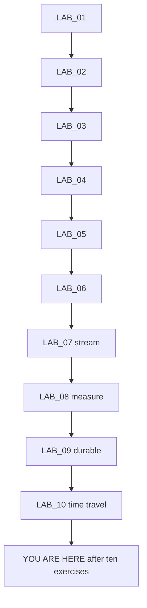

## GRAPH_L1_STATE_NODE_EDGE_MODEL

GRAPH_ID=GRAPH_L1_STATE_NODE_EDGE_MODEL
QUESTION_ANSWERED=What is a deterministic LangGraph?
NODE_SEMANTICS=Node
EDGE_SEMANTICS=Always next
STATE_SOURCE=src/lab01_deterministic.js
AUTHORITY_LIMIT=Visual only
UPDATE_TRIGGER=LAB_01 change
WHAT_IT_PROVES=No LLM is required
WHAT_IT_DOES_NOT_PROVE=S2 runtime replacement
CURRENT_DECISION_RELEVANCE=DEC-W4-091

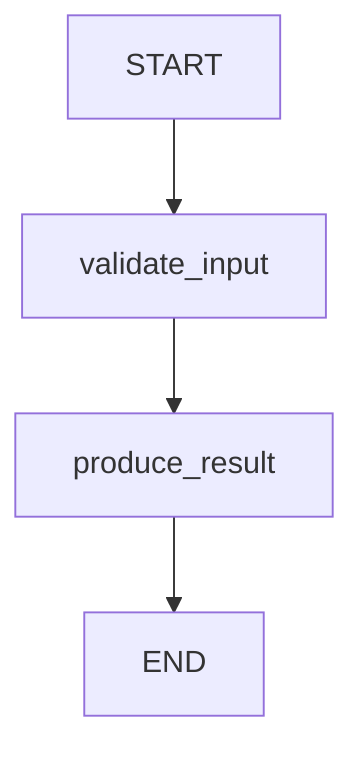

## GRAPH_L2_CONDITIONAL_LOOP

GRAPH_ID=GRAPH_L2_CONDITIONAL_LOOP
QUESTION_ANSWERED=How is retry bounded?
NODE_SEMANTICS=Route
EDGE_SEMANTICS=Conditional
STATE_SOURCE=src/lab02_conditional.js
AUTHORITY_LIMIT=Visual only
UPDATE_TRIGGER=LAB_02 change
WHAT_IT_PROVES=Max three retries
WHAT_IT_DOES_NOT_PROVE=Unbounded agent loops are safe
CURRENT_DECISION_RELEVANCE=DEC-W4-091

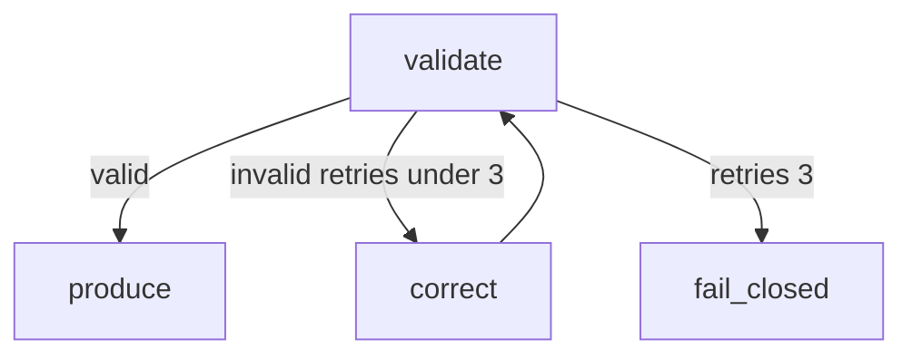

## GRAPH_L3_CHECKPOINT_AND_RESUME

GRAPH_ID=GRAPH_L3_CHECKPOINT_AND_RESUME
QUESTION_ANSWERED=How does thread_id resume work in the lab?
NODE_SEMANTICS=Checkpoint action
EDGE_SEMANTICS=Pause/resume
STATE_SOURCE=src/lab03_persistence.js
AUTHORITY_LIMIT=Visual only
UPDATE_TRIGGER=LAB_03 change
WHAT_IT_PROVES=MemorySaver can resume in-process
WHAT_IT_DOES_NOT_PROVE=Durability across restart
CURRENT_DECISION_RELEVANCE=DEC-W4-091

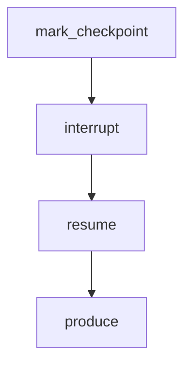

## GRAPH_L4_HUMAN_INTERRUPT

GRAPH_ID=GRAPH_L4_HUMAN_INTERRUPT
QUESTION_ANSWERED=When may a side effect run?
NODE_SEMANTICS=HITL step
EDGE_SEMANTICS=After decision
STATE_SOURCE=src/lab04_hitl.js
AUTHORITY_LIMIT=Visual only
UPDATE_TRIGGER=LAB_04 change
WHAT_IT_PROVES=Apply happens after approve/edit
WHAT_IT_DOES_NOT_PROVE=interrupt() is HUMAN authority
CURRENT_DECISION_RELEVANCE=DEC-W4-091

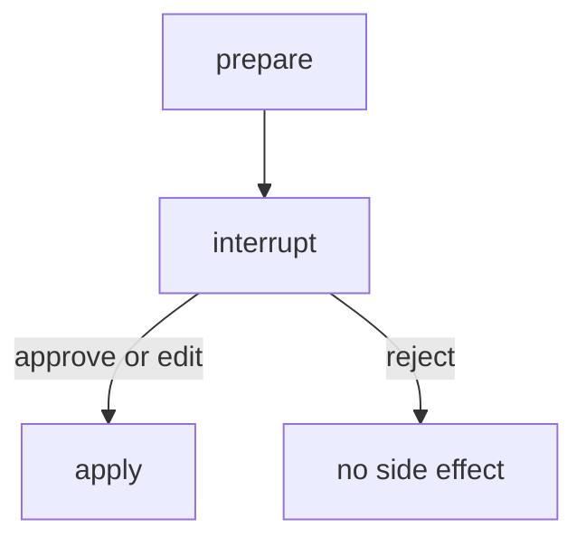

## GRAPH_L5_SUBGRAPH_AND_SERIAL_INTEGRATION

GRAPH_ID=GRAPH_L5_SUBGRAPH_AND_SERIAL_INTEGRATION
QUESTION_ANSWERED=How are worker results integrated?
NODE_SEMANTICS=Worker or integrator
EDGE_SEMANTICS=Serial
STATE_SOURCE=src/lab05_subgraphs.js
AUTHORITY_LIMIT=Visual only
UPDATE_TRIGGER=LAB_05 change
WHAT_IT_PROVES=One serialized write
WHAT_IT_DOES_NOT_PROVE=Safe concurrent file writes
CURRENT_DECISION_RELEVANCE=DEC-W4-091

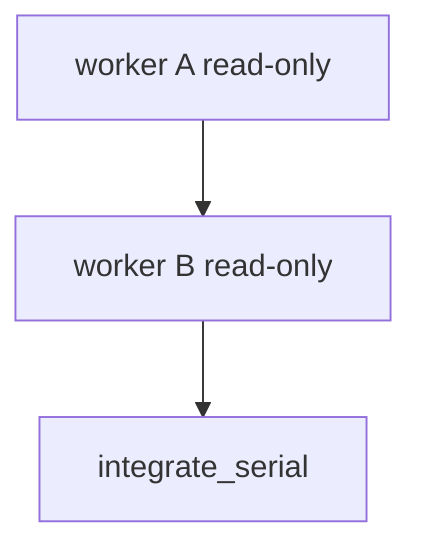

## GRAPH_L6_WINGS4_READ_ONLY_PILOT

GRAPH_ID=GRAPH_L6_WINGS4_READ_ONLY_PILOT
QUESTION_ANSWERED=Can a fixture-only briefing pause for human review?
NODE_SEMANTICS=Pilot step
EDGE_SEMANTICS=Sequence
STATE_SOURCE=src/lab06_pilot.js
AUTHORITY_LIMIT=Visual only
UPDATE_TRIGGER=LAB_06 change
WHAT_IT_PROVES=Classifications can be preserved on fixtures
WHAT_IT_DOES_NOT_PROVE=Equivalence with accepted S2
CURRENT_DECISION_RELEVANCE=DEC-W4-091

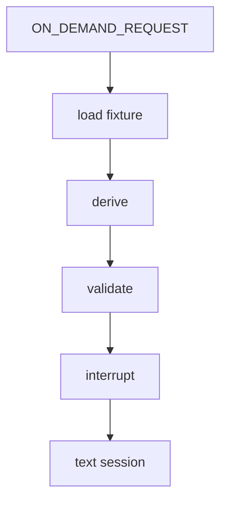

## GRAPH_L7_ADOPTION_DECISION_GATE

GRAPH_ID=GRAPH_L7_ADOPTION_DECISION_GATE
QUESTION_ANSWERED=Does completing the lab authorize product adoption?
NODE_SEMANTICS=Gate
EDGE_SEMANTICS=Does not auto-adopt
STATE_SOURCE=WINGS4.LANGGRAPH.ADOPTION.SCORECARD.md
AUTHORITY_LIMIT=Visual only
UPDATE_TRIGGER=Scorecard recommendation change
WHAT_IT_PROVES=Adoption remains a human decision
WHAT_IT_DOES_NOT_PROVE=S2.4 authorization
CURRENT_DECISION_RELEVANCE=DEC-W4-091

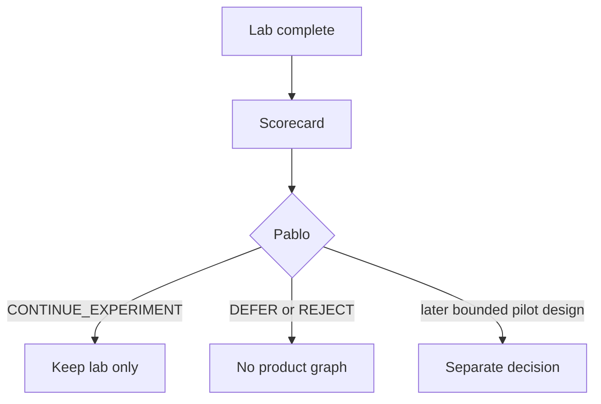

## GRAPH_L8_STREAMING_UPDATES

GRAPH_ID=GRAPH_L8_STREAMING_UPDATES
QUESTION_ANSWERED=Can node updates be observed without an LLM?
NODE_SEMANTICS=Stream event
EDGE_SEMANTICS=Update order
STATE_SOURCE=src/lab07_streaming.js
AUTHORITY_LIMIT=Visual only
UPDATE_TRIGGER=LAB_07 change
WHAT_IT_PROVES=streamMode=updates emits per-node payloads
WHAT_IT_DOES_NOT_PROVE=Observability of the accepted S2 runtime
CURRENT_DECISION_RELEVANCE=DEC-W4-091

## GRAPH_L9_MEASUREMENT_BOUNDARY

GRAPH_ID=GRAPH_L9_MEASUREMENT_BOUNDARY
QUESTION_ANSWERED=What do lab timings prove?
NODE_SEMANTICS=Evidence class
EDGE_SEMANTICS=Does not authorize
STATE_SOURCE=src/lab08_measurement.js
AUTHORITY_LIMIT=Visual only
UPDATE_TRIGGER=New measurement run
WHAT_IT_PROVES=Wall-clock samples for isolated graphs
WHAT_IT_DOES_NOT_PROVE=Production SLA or LangGraph adoption
CURRENT_DECISION_RELEVANCE=DEC-W4-091

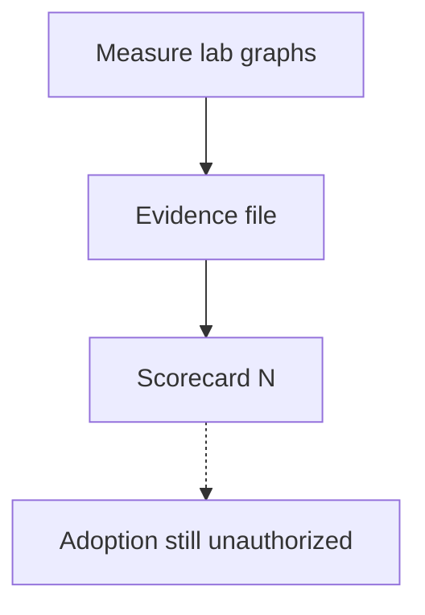

## GRAPH_L9_DURABLE_CHECKPOINT

GRAPH_ID=GRAPH_L9_DURABLE_CHECKPOINT
QUESTION_ANSWERED=Can a reconstructed checkpointer resume a stable thread_id?
NODE_SEMANTICS=Process/checkpointer reconstruction
EDGE_SEMANTICS=Same thread_id
STATE_SOURCE=src/lab09_durable.js
AUTHORITY_LIMIT=Visual only
UPDATE_TRIGGER=LAB_09 change
WHAT_IT_PROVES=Lab-local SqliteSaver can persist across a new saver instance
WHAT_IT_DOES_NOT_PROVE=Production durability, cloud storage, or S2 replacement
CURRENT_DECISION_RELEVANCE=DEC-W4-091
IMPLEMENTATION_STATUS=IMPLEMENTED_LAB_ONLY
SQLITE_PACKAGE=@langchain/langgraph-checkpoint-sqlite@1.0.4
SOURCE_URL=https://docs.langchain.com/oss/javascript/langgraph/checkpointers
RETRIEVAL_DATE=2026-08-21

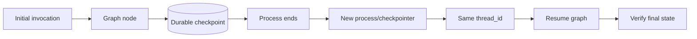

## GRAPH_L10_TIME_TRAVEL

GRAPH_ID=GRAPH_L10_TIME_TRAVEL
QUESTION_ANSWERED=Can a prior sqlite checkpoint be replayed?
NODE_SEMANTICS=Historical checkpoint
EDGE_SEMANTICS=Replay from checkpoint_id
STATE_SOURCE=src/lab10_timetravel.js
AUTHORITY_LIMIT=Visual only
UPDATE_TRIGGER=LAB_10 change
WHAT_IT_PROVES=getStateHistory plus invoke from a prior config replays later nodes
WHAT_IT_DOES_NOT_PROVE=Idempotent production replay or S2 time travel
CURRENT_DECISION_RELEVANCE=DEC-W4-091
SOURCE_URL=https://docs.langchain.com/oss/javascript/langgraph/use-time-travel
RETRIEVAL_DATE=2026-08-21
PROMPT_NOTE=LAB-10 body was truncated in the executor prompt; this exercise uses the official time-travel guide that follows durable checkpoints.

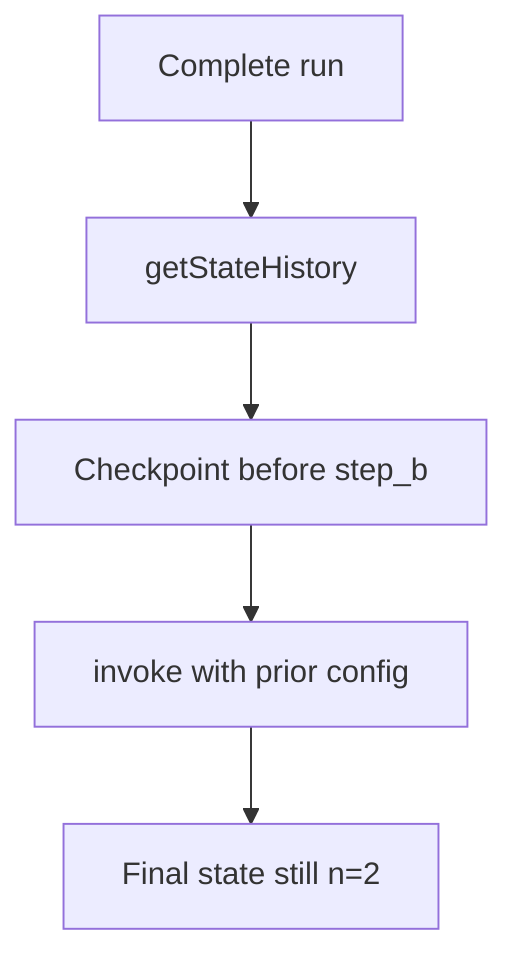
