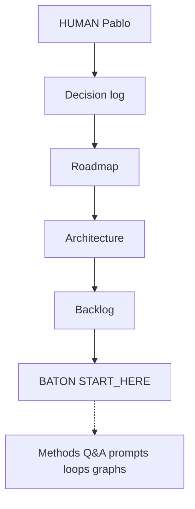
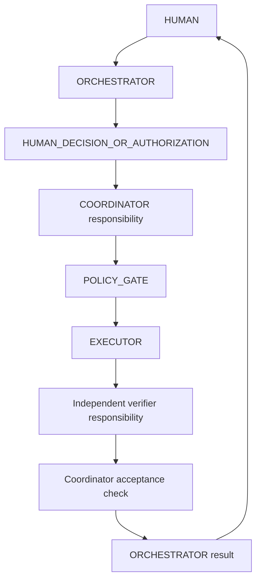
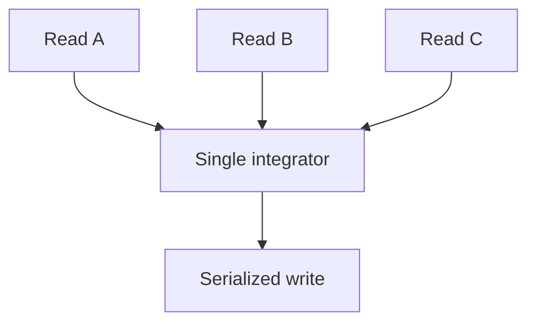
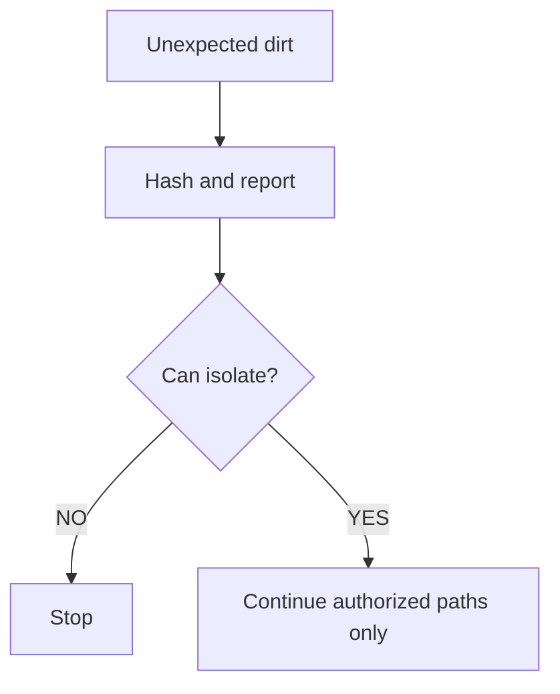
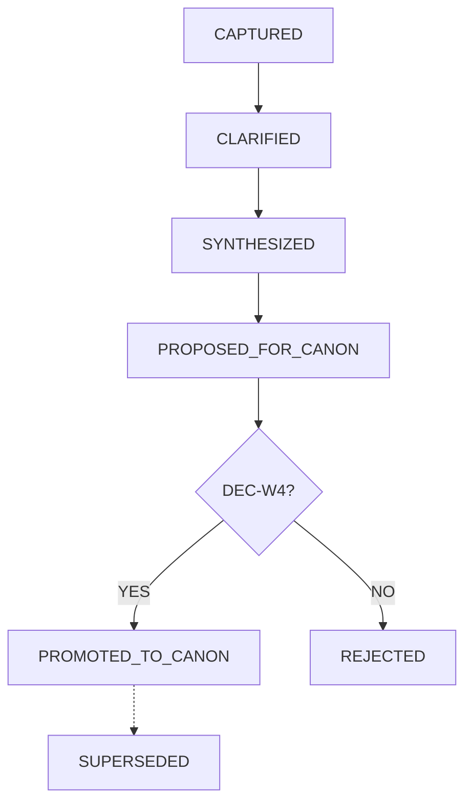
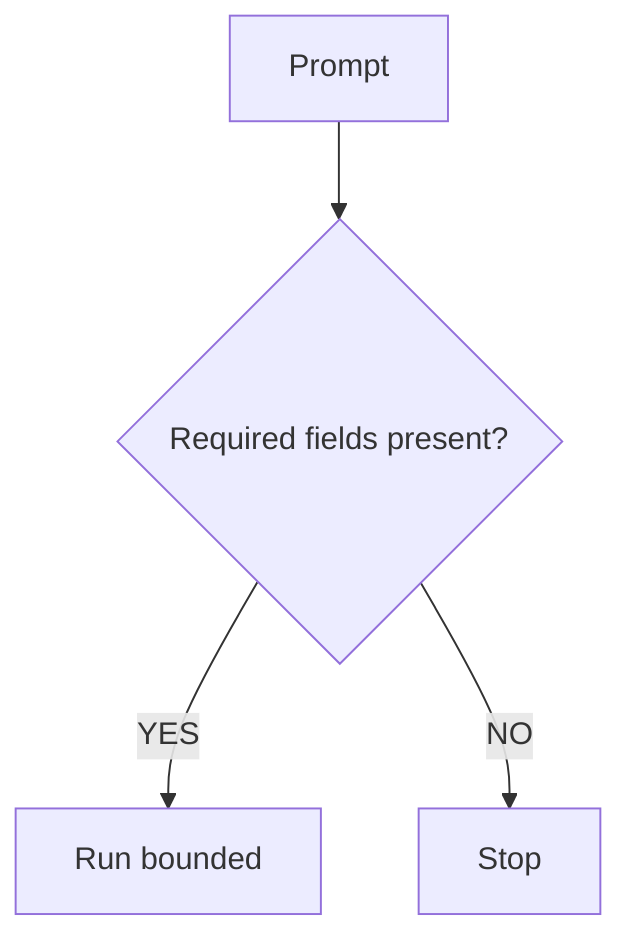
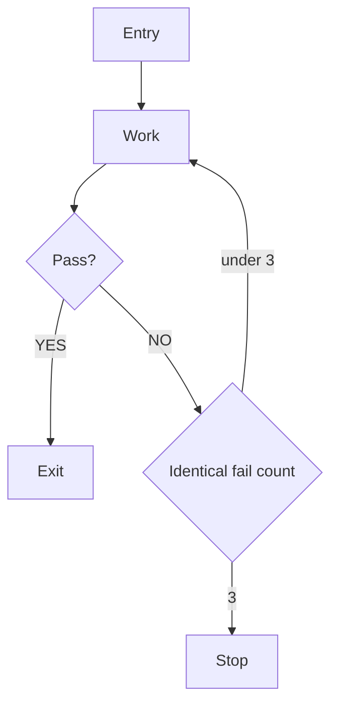
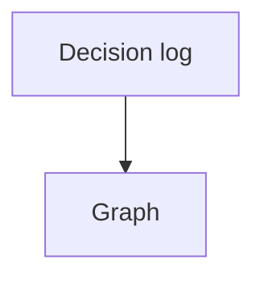

# Wings4 HUMAN-AI Workflow Foundation

FOUNDATION_ID=W4_HUMAN_AI_WORKFLOW
AUTHORITY_DECISION=DEC-W4-092; DEC-W4-093
STATUS=IMPLEMENTED_GOVERNANCE
PRODUCT_CAPABILITY=NO
REPLACES_DECISION_LOG=NO
REPLACES_ROADMAP=NO
REPLACES_HUMAN_DIRECTORY=NO
COORDINATOR_IS_RESPONSIBILITY=YES
COORDINATOR_IS_SEPARATE_PERSONA=NO
C1_CLASSIFICATION=PABLO_REQUESTED_OPTIONAL_COLLABORATION_PREFERENCE
C1_IS_PRODUCT_GAP=NO
C1_IS_PRODUCT_DOCTRINE=NO
LANGGRAPH_PRODUCT_ADOPTION_AUTHORIZED=NO

This file is the project-local contract for how HUMAN, ORCHESTRATOR, COORDINATOR responsibility, and EXECUTOR work together in Wings4.

It is not decision authority. It is not the product roadmap. It is not a second HUMAN directory. It does not copy SkillsLake, GRCLake, or Skills HUMAN.

## 0. Authority chain

HUMAN is the spirit, purpose, authority, and governing center of Wings4.

Precedence:

1. Pablo's explicit current authorization.
2. `PORTFOLIO.DECISION_LOG.md`
3. `PORTFOLIO.ROADMAP.md`
4. `PORTFOLIO.ARCHITECTURE/`
5. `MIGRATION.BACKLOG.md`
6. `00_STATE/BATON.WINGS4.ACTIVE.md`
7. `SESSIONS/ORCHESTRATOR/03.SESSION_CONTINUE/00.START_HERE.ORCHESTRATOR.txt`
8. Project-local implementation and tests.
9. Reference repositories as non-authoritative evidence only.
10. Chat, prompts, loops, graphs, and temporary reports as evidence or methods only.

Never allow:

- REFERENCE_MATERIAL > WINGS4_CANON
- GRAPH > DECISION_LOG
- PROMPT > HUMAN_AUTHORIZATION
- CHAT_HISTORY > ROADMAP
- BATON > DECISION_LOG
- LANGGRAPH_STATE > HUMAN_AUTHORITY

HUMAN > governed product state > orchestration runtime.

### GRAPH_W1_AUTHORITY_CHAIN

GRAPH_ID=GRAPH_W1_AUTHORITY_CHAIN
QUESTION_ANSWERED=Who outranks whom in Wings4 work?
NODE_SEMANTICS=Authority or derived surface
EDGE_SEMANTICS=Governs or derives
STATE_SOURCE=DEC-W4-090; PORTFOLIO.DECISION_LOG.md
AUTHORITY_LIMIT=Visual only
UPDATE_TRIGGER=New governed decision that changes precedence
WHAT_IT_PROVES=Decision log outranks roadmap, BATON, prompts, and graphs
WHAT_IT_DOES_NOT_PROVE=That a graph or prompt created a product decision
CURRENT_DECISION_RELEVANCE=DEC-W4-090

## 1. Role and workflow governance

Required conceptual flow:

HUMAN → ORCHESTRATOR → HUMAN_DECISION_OR_AUTHORIZATION → COORDINATOR → POLICY_GATE → EXECUTOR.

EXECUTOR result → Independent verifier responsibility → Coordinator acceptance check → ORCHESTRATOR result → HUMAN acceptance.

ORCHESTRATOR analyzes, proposes, and presents gates. COORDINATOR responsibility decomposes bounded work, controls dependencies, and prevents collisions. EXECUTOR applies authorized mutations and validations. WORK_UNITS produce isolated evidence or proposed outputs. INTEGRATOR performs the single serialized integration.

The Independent verifier is an independent responsibility that validates evidence and the authorization/envelope only. It is not a permanent agent, a new authority, or a replacement for HUMAN acceptance.

The Coordinator is a responsibility, not necessarily a separate person, a separate visible AI persona, a permanent agent, or a new authority layer.

Pablo does not need to approve every mechanical action already contained inside an explicitly authorized bounded outcome.

Human approval remains mandatory for:

- material scope expansion;
- new product capability;
- product dependency adoption;
- HUMAN/ changes;
- implementation authorization where design-only authority exists;
- commit or push unless explicitly authorized;
- destructive or irreversible actions;
- external communications;
- reinterpretation of product authority.

Parallel work is allowed only for independent read-only inspection. All shared writes must be serialized through one integrator responsibility.

Escalation triggers:

- HUMAN/ mutation would be required;
- repository identity is ambiguous;
- unknown staged or dirty work cannot be isolated;
- product runtime would change without authorization;
- S2.4, catalog, S3, or S4 work would begin;
- three materially identical failures;
- authority conflict cannot be resolved from canon.

### GRAPH_W2_HUMAN_AI_WORKFLOW

GRAPH_ID=GRAPH_W2_HUMAN_AI_WORKFLOW
QUESTION_ANSWERED=How does authorized work move from HUMAN to durable result?
NODE_SEMANTICS=Responsibility
EDGE_SEMANTICS=Hands off a bounded packet
STATE_SOURCE=this file section 1
AUTHORITY_LIMIT=Visual only
UPDATE_TRIGGER=Role contract change by decision
WHAT_IT_PROVES=Coordinator is inside the flow, not a second HUMAN; evidence/envelope validation remains independent from acceptance
WHAT_IT_DOES_NOT_PROVE=That Pablo must approve every mechanical step or that the verifier creates authority
CURRENT_DECISION_RELEVANCE=DEC-W4-092; DEC-W4-093

### GRAPH_W3_PARALLEL_READ_SERIAL_WRITE

GRAPH_ID=GRAPH_W3_PARALLEL_READ_SERIAL_WRITE
QUESTION_ANSWERED=When may work run in parallel?
NODE_SEMANTICS=Read versus write
EDGE_SEMANTICS=Allowed path
STATE_SOURCE=this file section 1
AUTHORITY_LIMIT=Visual only
UPDATE_TRIGGER=Collision-control change by decision
WHAT_IT_PROVES=Shared writes are serialized
WHAT_IT_DOES_NOT_PROVE=That parallel agents may edit the same files
CURRENT_DECISION_RELEVANCE=DEC-W4-090

## 2. Identity and repository gate

Before mutation, resolve:

- exact project root;
- branch;
- HEAD;
- origin alignment;
- operation mode;
- authorized paths;
- forbidden paths;
- expected dirty-state ownership.

Default Wings4 identity:

ROOT=`C:\01. GitHub\Wings4.0`
BRANCH_REQUIRED=`main` unless a later decision names another branch
FORBIDDEN_PATHS=`HUMAN/`; child-project repositories; `C:\01. GitHub\Skills`; product runtime unless explicitly authorized
TEMP_ROOT=`C:\Users\aazcl\Downloads\T.Wings4.0`

Fail closed if:

- branch is not the required branch;
- origin/main is unavailable without explanation;
- repository identity is ambiguous;
- merge, rebase, cherry-pick, or bisect is active;
- unmerged paths exist;
- unexpected staged files exist;
- another process appears to be actively mutating the same files.

## 3. Unknown-worktree contract

If dirty files are unexpected:

- do not overwrite;
- do not revert;
- do not stage;
- hash and report;
- isolate authorized work or stop.

Inherited HUMAN/ dirt is reported separately and preserved byte-for-byte.

### GRAPH_W8_UNKNOWN_WORKTREE_RESPONSE

GRAPH_ID=GRAPH_W8_UNKNOWN_WORKTREE_RESPONSE
QUESTION_ANSWERED=What happens when unexpected dirt exists?
NODE_SEMANTICS=Control action
EDGE_SEMANTICS=Fail-closed path
STATE_SOURCE=this file section 3
AUTHORITY_LIMIT=Visual only
UPDATE_TRIGGER=Worktree-gate change by decision
WHAT_IT_PROVES=Unknown dirt is preserved, not cleaned destructively
WHAT_IT_DOES_NOT_PROVE=That dirty HUMAN/ files may be staged
CURRENT_DECISION_RELEVANCE=DEC-W4-090

## 4. Q&A lifecycle

Q&A is evidence, not a second decision log.

Human-owned capture remains `HUMAN/Q_AND_A.md` and related HUMAN files. This foundation does not mutate HUMAN/.

Project-local compiled current view:

`00_STATE/WINGS4.QA.COMPILED.CURRENT.md`

Append-only project-local raw evidence, when an executor needs a non-HUMAN capture:

`00_STATE/WINGS4.QA.RAW.EVIDENCE.md`

States:

- CAPTURED
- CLARIFIED
- SYNTHESIZED
- PROPOSED_FOR_CANON
- PROMOTED_TO_CANON
- SUPERSEDED
- REJECTED

Promotion to canon requires a governed DEC-W4 decision. Provenance must name the question, answer, and promoting decision.

### GRAPH_W4_QA_TO_CANON

GRAPH_ID=GRAPH_W4_QA_TO_CANON
QUESTION_ANSWERED=How does a Q&A item become canon?
NODE_SEMANTICS=Q&A state
EDGE_SEMANTICS=Promotion or rejection
STATE_SOURCE=this file section 4
AUTHORITY_LIMIT=Visual only
UPDATE_TRIGGER=Q&A state-machine change by decision
WHAT_IT_PROVES=Promotion requires a decision
WHAT_IT_DOES_NOT_PROVE=That compiled Q&A is itself a decision log
CURRENT_DECISION_RELEVANCE=DEC-W4-090

## 5. Prompt readiness contract

A bounded executor prompt is ready only when it declares:

- objective;
- role;
- authority;
- scope;
- exclusions;
- required evidence;
- unknown policy;
- mutation allowlist;
- loops;
- graphs;
- acceptance criteria;
- tests;
- commit/push authority;
- output contract;
- stop conditions.

### GRAPH_W5_PROMPT_READINESS_GATE

GRAPH_ID=GRAPH_W5_PROMPT_READINESS_GATE
QUESTION_ANSWERED=When may an executor prompt run?
NODE_SEMANTICS=Readiness check
EDGE_SEMANTICS=Pass or fail closed
STATE_SOURCE=this file section 5
AUTHORITY_LIMIT=Visual only
UPDATE_TRIGGER=Prompt-contract change by decision
WHAT_IT_PROVES=Missing authority fails closed
WHAT_IT_DOES_NOT_PROVE=That a complete prompt outranks HUMAN
CURRENT_DECISION_RELEVANCE=DEC-W4-090

## 6. Loop contract

Default maximum: six top-level loops.

Every loop must declare:

- LOOP_ID
- PURPOSE
- INPUTS
- ENTRY_CONDITION
- EXIT_CONDITION
- MAX_ITERATIONS
- MUTATION_ALLOWED
- OWNER_RESPONSIBILITY
- EVIDENCE_OUTPUT
- PASS_CONDITION
- FAIL_CONDITION
- UNKNOWN_POLICY

Rules:

- no infinite loops;
- no silent retries;
- no retry without changed evidence or corrective action;
- stop after three materially identical failures;
- report actual iterations, not planned iterations;
- heartbeat at least every five minutes for work longer than five minutes;
- a graph is not proof that a loop ran.

### GRAPH_W6_LOOP_LIFECYCLE

GRAPH_ID=GRAPH_W6_LOOP_LIFECYCLE
QUESTION_ANSWERED=How does a governed loop start and stop?
NODE_SEMANTICS=Loop control
EDGE_SEMANTICS=Iteration or stop
STATE_SOURCE=this file section 6
AUTHORITY_LIMIT=Visual only
UPDATE_TRIGGER=Loop-contract change by decision
WHAT_IT_PROVES=Loops are bounded and evidenced
WHAT_IT_DOES_NOT_PROVE=That drawing the loop executed it
CURRENT_DECISION_RELEVANCE=DEC-W4-090

## 7. Graph contract

Each governed graph must declare:

- GRAPH_ID
- QUESTION_ANSWERED
- NODE_SEMANTICS
- EDGE_SEMANTICS
- STATE_SOURCE
- AUTHORITY_LIMIT
- UPDATE_TRIGGER
- WHAT_IT_PROVES
- WHAT_IT_DOES_NOT_PROVE
- CURRENT_DECISION_RELEVANCE

Graphs visualize governed state. Graphs do not create authority.

### GRAPH_W7_GRAPH_AUTHORITY_BOUNDARY

GRAPH_ID=GRAPH_W7_GRAPH_AUTHORITY_BOUNDARY
QUESTION_ANSWERED=Does a Mermaid graph create product authority?
NODE_SEMANTICS=Authority versus visualization
EDGE_SEMANTICS=Does not govern
STATE_SOURCE=this file section 7
AUTHORITY_LIMIT=Visual only
UPDATE_TRIGGER=Graph-contract change by decision
WHAT_IT_PROVES=Graphs remain below the decision log
WHAT_IT_DOES_NOT_PROVE=That a complete diagram is an approved product change
CURRENT_DECISION_RELEVANCE=DEC-W4-090

## 8. TEMP taxonomy

Distinguish at least:

- execution scratch;
- graph sandbox;
- AI exchange / upload-ready;
- generated evidence / report;
- disposable cache.

Canonical TEMP_ROOT for Wings4 upload-ready evidence:

`C:\Users\aazcl\Downloads\T.Wings4.0`

Rules:

- temporary locations must not become canon;
- do not move the canonical roadmap to TEMP;
- prefer one consolidated upload artifact;
- never exceed ten TEMP files without explicit justification;
- purge only that exact authorized folder before a final report;
- keep it flat;
- do not leave node_modules, checkpoints, or repository clones there.

## 9. C1

Cambridge C1 coaching is a Pablo-requested optional collaboration preference.

It is not a product gap.
It is not product doctrine.
It is not mandatory for other humans.
This foundation does not relocate or edit C1 material under HUMAN/.

## 10. Identity of this foundation versus product

This foundation does not:

- implement S2.4;
- create the operative OPEN_DECISION catalog;
- implement S3 or S4;
- change accepted S2/S2.3 runtime behavior;
- add LangGraph to the production runtime;
- copy SkillsLake or GRCLake.

## 11. Reconciliación operativa DEC-W4-097

El laboratorio LangGraph aceptado bajo DEC-W4-097 permanece experimental y fuera del producto. Loop 6/7 verificó LAB10=PASS y VERIFICATION=PASS con salida de ejecución en OS TEMP; no produjo salida de laboratorio en el repositorio ni mutó checkpoints o HUMAN en este loop. La evidencia retenida es `EXPERIMENTS/LANGGRAPH_WINGS4_LAB/checkpoints/lab09-test.sqlite` SHA-256 `60383dccb4f692968decb4d296f65a9c7b66e3004b26682d2cdaf0719ce96f55` y `EXPERIMENTS/LANGGRAPH_WINGS4_LAB/checkpoints/lab10-test.sqlite` SHA-256 `79d5766283a499b53f10a874ab6da992fbc41660cbf128f9a42b2b10176a9141`; cleanup/restauración sigue prohibido.

Loop 3.1–3.3 carecen de sustanciación. El actor se conserva como RETAINED_NONADOPTED y no gana autoridad, adopción ni permiso de mutación. La política de conflicto HUMAN permanece: el canon humano local y la autoridad de Pablo prevalecen; análisis paralelo es sólo lectura/evidencia y no permite reinterpretar ni mutar HUMAN. S2.4, S3 y S4 no están autorizados. Push, Package 2 y paquete de continuación siguen prohibidos.
