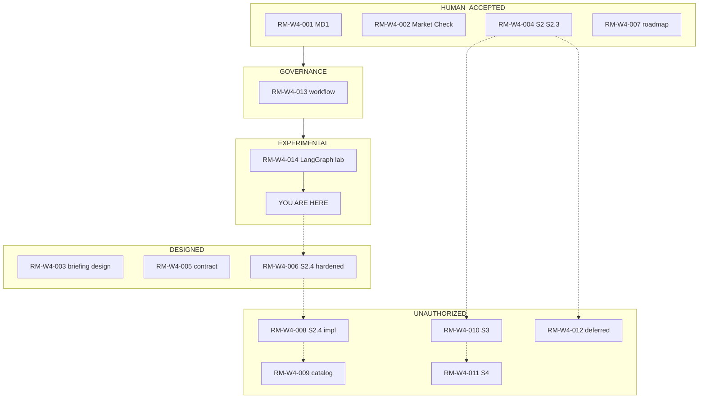
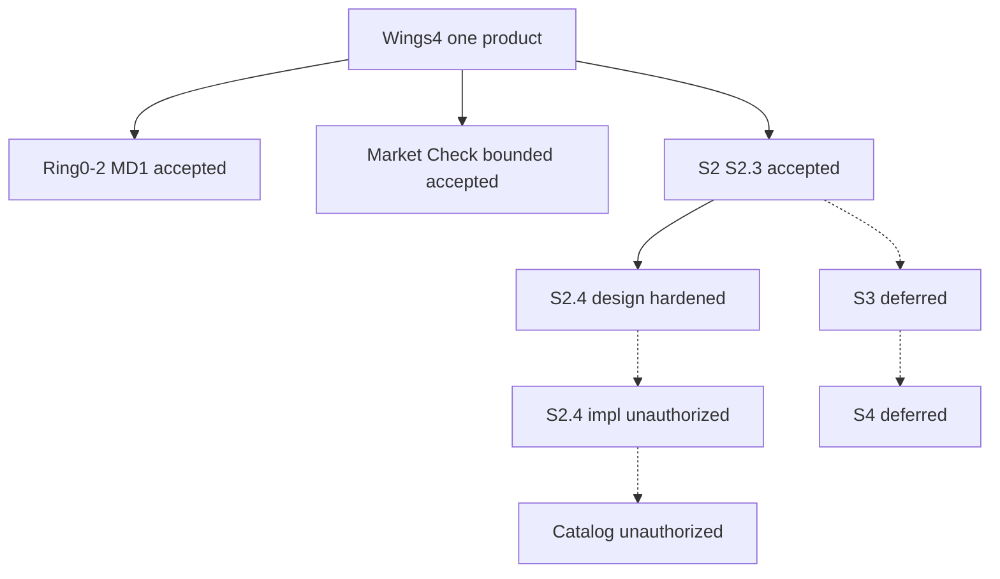
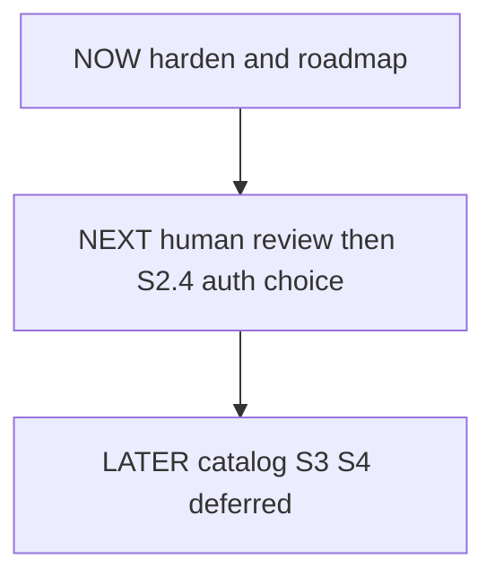
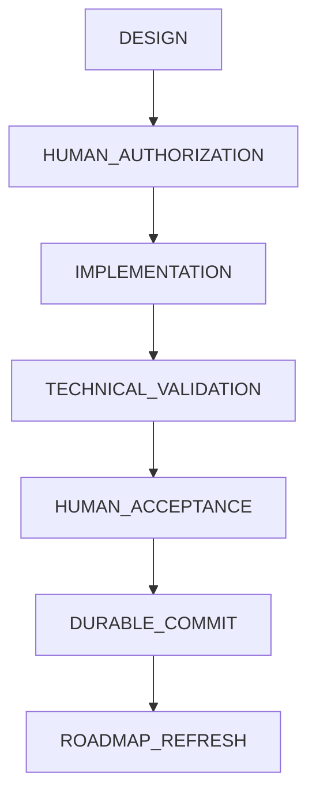
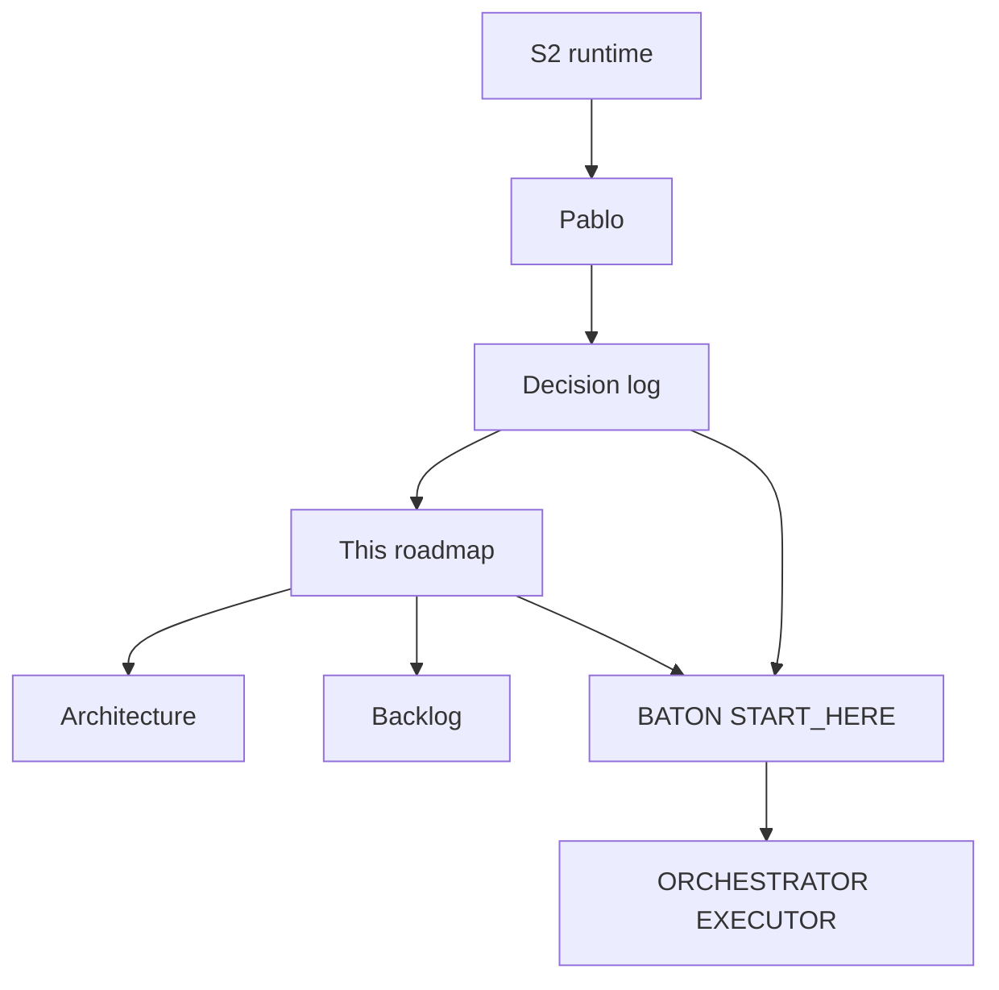
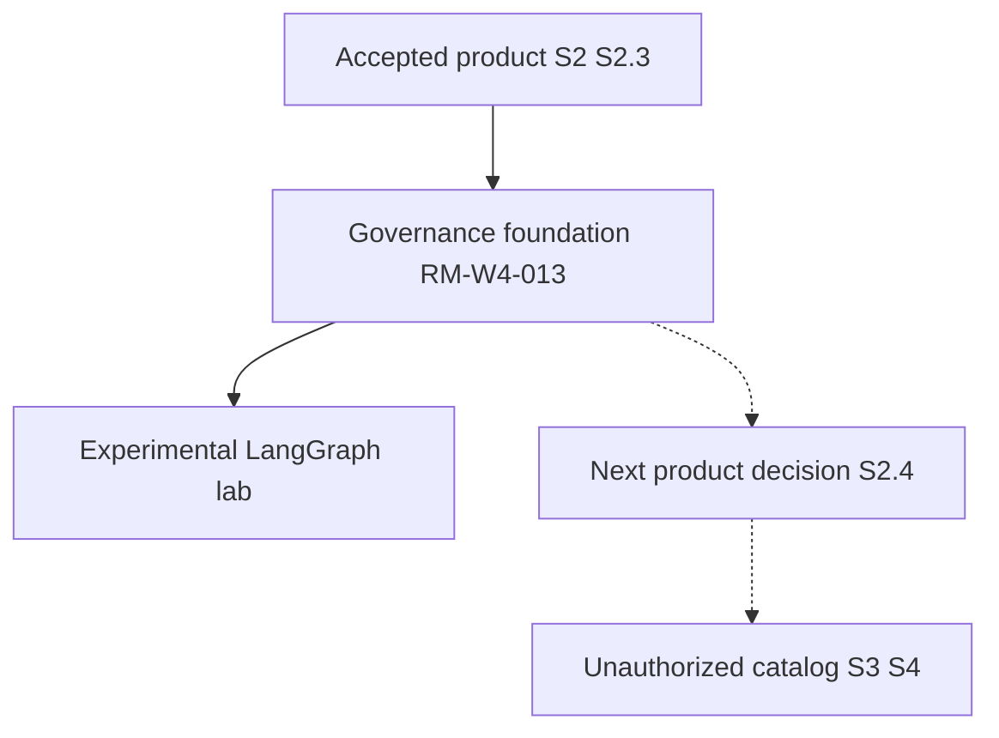

# Wings4.0 Product Roadmap

ROADMAP_ID=W4_PRODUCT_ROADMAP
PROJECT_ID=Wings4.0
HUMAN_AUTHORITY=Pablo
CANONICAL_ROADMAP=YES
ROADMAP_SCOPE=ONE_UNIFIED_WINGS_PRODUCT
ROADMAP_AUTHORITY_LIMIT=SEQUENCING_STATUS_DEPENDENCIES_AND_POINTERS
DECISION_AUTHORITY=PORTFOLIO.DECISION_LOG.md
DETAILED_WORK_REGISTER=MIGRATION.BACKLOG.md
ACTIVE_STATE_SURFACE=00_STATE/BATON.WINGS4.ACTIVE.md
SESSION_ENTRYPOINT=SESSIONS/ORCHESTRATOR/03.SESSION_CONTINUE/00.START_HERE.ORCHESTRATOR.txt
ROADMAP_CURRENTNESS_SOURCE=LATEST_GOVERNED_DECISION_PLUS_GIT_VERIFIED_STATE
HISTORICAL_CHAT_REQUIRED_TO_UNDERSTAND_ROADMAP=NO
ESTABLISHING_DECISION=DEC-W4-088
S2_4_HARDENING_DECISION=DEC-W4-087
ROADMAP_ACCEPTANCE_DECISION=DEC-W4-089
UPDATED_AT_DECISION=DEC-W4-097

## 0. Roadmap Identity and Authority

This file is the single human-facing product roadmap for Wings4.0. It answers where the one unified Wings product is going, what is accepted, what is designed but unauthorized, and what Pablo must decide next.

It is canonical for roadmap structure, sequencing, status view, dependencies, and planned delivery.

It is not:

- decision authority (`PORTFOLIO.DECISION_LOG.md`);
- a work-item register (`MIGRATION.BACKLOG.md`);
- derived operational state (`00_STATE/BATON.WINGS4.ACTIVE.md`);
- session continuation (`SESSIONS/ORCHESTRATOR/03.SESSION_CONTINUE/00.START_HERE.ORCHESTRATOR.txt`);
- capability design (`PORTFOLIO.ARCHITECTURE/`);
- Q&A, prompts, loops, or graphs.

Q&A, prompts, loops, and graphs are evidence or methods. They become roadmap-relevant only after a governed decision, design, or this file is updated.

ORCHESTRATOR and EXECUTOR are internal roles inside one product, not separate roadmap branches.

## 1. Product North Star

Wings4 maintains an integrated, current and actionable understanding of the complete portfolio. It detects conflicts, discrepancies, interference, omissions, duplication and opportunities; checks whether existing portfolio capabilities or external solutions can replace or complement planned development; recommends and prioritizes action; coordinates controlled execution through the appropriate project authority; and independently verifies the resulting state while preserving human authority and project-local governance.

Authority: DEC-W4-061; `PORTFOLIO.ARCHITECTURE/WINGS4.PRODUCT.IDENTITY.md`.

Presentations, reports, BATON, RADAR, GRC, architecture, and planning alone are not product functionality.

## 2. Current Executive Position

Verified baseline at roadmap generation. Runtime Git remains current HEAD truth. This hash is not permanently current.

CURRENT_DURABLE_HEAD=2df515376b07cda4125a59b06ded49891af1c0a4
LATEST_DURABLE_DECISION_AT_GENERATION=DEC-W4-090
LATEST_WORKING_TREE_DECISION=DEC-W4-096
S2_HUMAN_ACCEPTANCE=ACCEPTED
S2_3_HUMAN_ACCEPTANCE=ACCEPTED
S2_4_DESIGN_STATUS=APPROVED
S2_4_DESIGN_HARDENING_STATUS=PASS
S2_4_AUTHORIZED=NO
S2_4_IMPLEMENTED=NO
OPEN_DECISIONS=UNKNOWN
OPERATIVE_OPEN_DECISION_CATALOG_CREATED=NO
S3_AUTHORIZED=NO
S4_AUTHORIZED=NO
WINGS4_COMPLETE=NO
PRODUCTION_COMPLETE=NO
ROADMAP_CURRENT_ITEM_ID=RM-W4-014
ROADMAP_HUMAN_ACCEPTANCE=ACCEPTED
ROADMAP_NEXT_GATE=HUMAN_DECIDE_NEXT_AUTHORIZED_SCOPE_OR_CONFIRM_DEFERRAL
NEXT_PRODUCT_ACTION=HUMAN_DECIDE_NEXT_AUTHORIZED_SCOPE_OR_CONFIRM_DEFERRAL
NEXT_SESSION_OPTION_SELECTED=NO
COMMIT=AUTHORIZED_PHASE_3
PUSH=AUTHORIZED_PHASE_3

FACT: Bounded S2/S2.3 is accepted. S2.4 design is approved and hardened. S2.4 implementation is not authorized. No operative catalog exists. OPEN_DECISIONS remains UNKNOWN.

### GRAPH_R0_COMPLETE_ROADMAP_AND_CURRENT_POSITION

YOU_ARE_HERE=RM-W4-014_LANGGRAPH_OS_TEMP_ISOLATION_ACCEPTED

This diagram is the first-class complete-roadmap view. Status labels below are visual only. They do not change RM-W4 item STATUS fields. The reference-adoption study is a temporary review activity, not a new roadmap item.

Legend: HUMAN_ACCEPTED | IMPLEMENTED_NOT_YET_ACCEPTED | DESIGNED | CURRENT_REVIEW | PROPOSED | DEFERRED | UNAUTHORIZED

What it proves: Accepted product baseline, current governance foundation, experimental lab present, S2.4 still unauthorized.
What it does not prove: LangGraph product adoption or S2.4 implementation.
Current governed decision: DEC-W4-097 accepts RM-W4-014 OS TEMP isolation. Valid execution evidence records LAB10=PASS; repository runtime output=0, with no checkpoint or HUMAN mutation in Loop 6/7 according to retained comparisons. The retained verifier artifact is invalid JSON, so machine-readable independent verification PASS is not established. Retained evidence/checkpoint cleanup boundary remains governed by DEC-W4-097 and its forward clarification.
How to update YOU ARE HERE: after a later human decision, move Here to the selected product gate; do not treat graphs as authority.
Evidence pointers: DEC-W4-092; DEC-W4-093; DEC-W4-096; EXPERIMENTS/LANGGRAPH_WINGS4_LAB/README.md.

## 3. Delivered and Human-Accepted Baseline

| Capability | Delivered | Tested | Human accepted | Class |
|---|---|---|---|---|
| Ring0/Ring1/Ring2 bounded baseline | YES | YES | YES (MD1 / DEC-W4-062) | HUMAN_ACCEPTED |
| Management Delivery #1 | YES | YES | YES; closed | HUMAN_ACCEPTED |
| Bounded Market Check Ring0 demo | YES | YES | YES bounded (DEC-W4-071); not Wings4 complete | HUMAN_ACCEPTED |
| Push-first briefing design | YES | Design validation | Design recorded (DEC-W4-078) | DESIGNED |
| Briefing-runtime planning | YES | — | Planning recorded (DEC-W4-079) | PLANNED |
| S2 on-demand briefing | YES | 77 PASS | YES (DEC-W4-084 H1) | HUMAN_ACCEPTED |
| S2.1 / S2.2 / S2.3 corrections | YES | 77 PASS | Included in H1 | HUMAN_ACCEPTED |
| OPEN_DECISION contract | YES canon | S2.3 tests | Design canonized (DEC-W4-083); not consumed | DESIGNED |
| S2.4 consumption design | YES | Design audit | D1–D5 approved (DEC-W4-086); hardened (DEC-W4-087) | DESIGNED |
| Canonical product roadmap | YES this recording | — | Pending human review (DEC-W4-088) | IMPLEMENTED |
| S2.4 implementation | NO | NO | NO | UNAUTHORIZED |
| Operative OPEN_DECISION catalog | NO | NO | NO | UNAUTHORIZED |
| S3 / S4 | NO | NO | NO | UNAUTHORIZED |

Fixture or demo completeness is not production completeness.

## 4. Current Capability Map

L0 product: one Wings4 user-facing product.

L1 capabilities now in view:

1. Portfolio diagnosis and decision support (Ring0–Ring2, MD1 accepted).
2. Bounded on-demand Market Check (Ring0 demo complete; not monitoring).
3. Push-first briefing (S2 accepted; S2.4 designed/hardened, unauthorized).
4. OPEN_DECISION governance (contract canon; catalog absent; consumption unauthorized).
5. Product roadmap governance (this file; DEC-W4-088).

## 5. Now / Next / Later

NOW (this recording; not yet human-reviewed as a durable commit):

- RM-W4-006 S2.4 design hardening (DEC-W4-087).
- RM-W4-007 Canonical roadmap establishment (DEC-W4-088).
- Continuity-lag notes for DEC-W4-086 commit hash and backlog 049/050.

NEXT:

- Human review of the hardened S2.4 design and this roadmap.
- Separate human decision whether to authorize bounded S2.4 implementation (no catalog creation).
- If authorized: parser/validator, tests, human acceptance, then a later commit/push gate.

LATER (unauthorized unless a new decision says otherwise):

- Operative catalog authorization and governed population or explicit out-of-scope disposition.
- S3 design/authorization.
- S4 design/authorization.
- WHOAMI/`finding_class`, COPY-as-export, second-entity diagnostic.
- Ring3, RADAR, MARKET_MONITORING, live web, capture form, auto-delivery.

No item appears here merely because it is desirable.

## 6. Roadmap Work Breakdown Structure

L0_PRODUCT = Wings4.0 unified product
L1_CAPABILITY = see section 4
L2_DELIVERY_SLICE = RM-W4-NNN items below
L3_GOVERNED_OUTCOME = decision + acceptance gate
L4_IMPLEMENTATION_OR_VALIDATION_TASK_POINTER = `MIGRATION.BACKLOG.md`

### RM-W4-001 — Ring0/Ring1/Ring2 and MD1 baseline

ROADMAP_ITEM_ID=RM-W4-001
TITLE=Bounded Ring0-Ring2 baseline and Management Delivery 1
OUTCOME=Operable local diagnosis, decision lifecycle, return verification; gerencia accepted MD1
STATUS=HUMAN_ACCEPTED
HUMAN_VALUE=First demonstrated Wings product slice
DEPENDENCIES=NONE
BLOCKED_BY=NONE
DECISION_ID=DEC-W4-062
AUTHORIZATION_STATUS=AUTHORIZED_HISTORICAL
IMPLEMENTATION_STATUS=IMPLEMENTED
ACCEPTANCE_STATUS=HUMAN_ACCEPTED
EVIDENCE_POINTERS=PORTFOLIO.ARCHITECTURE/WINGS4.INCREMENTAL.DELIVERY.MODEL.md; PORTFOLIO.DECISION_LOG.md#dec-w4-062
NEXT_GATE=NONE_KEEP_CLOSED
NEXT_ACTION=Do not reopen MD1
OWNER_ROLE=ORCHESTRATOR
UPDATED_AT_DECISION=DEC-W4-062

### RM-W4-002 — Bounded Market Check

ROADMAP_ITEM_ID=RM-W4-002
TITLE=Bounded on-demand Market Check Ring0 demo
OUTCOME=On-demand MARKET_CHECK on the existing Ring0 surface; not monitoring
STATUS=HUMAN_ACCEPTED
HUMAN_VALUE=Alternatives before recommendation when evidence exists
DEPENDENCIES=RM-W4-001
BLOCKED_BY=NONE
DECISION_ID=DEC-W4-071
AUTHORIZATION_STATUS=AUTHORIZED_HISTORICAL
IMPLEMENTATION_STATUS=IMPLEMENTED
ACCEPTANCE_STATUS=HUMAN_ACCEPTED_BOUNDED
EVIDENCE_POINTERS=PORTFOLIO.ARCHITECTURE/WINGS4.MARKET_CHECK.RUNTIME.SPEC.md
NEXT_GATE=NONE_KEEP_BOUNDED
NEXT_ACTION=Do not generalize to Wings4 complete
OWNER_ROLE=ORCHESTRATOR
UPDATED_AT_DECISION=DEC-W4-071

### RM-W4-003 — Push-first briefing design and planning

ROADMAP_ITEM_ID=RM-W4-003
TITLE=Push-first briefing design and planning
OUTCOME=Eight-section briefing schema designed and planned
STATUS=DESIGNED
HUMAN_VALUE=What changed / what matters / what needs a decision
DEPENDENCIES=RM-W4-001
BLOCKED_BY=NONE
DECISION_ID=DEC-W4-078
AUTHORIZATION_STATUS=DESIGN_AND_PLANNING_ONLY
IMPLEMENTATION_STATUS=SUPERSEDED_FOR_RUNTIME_BY_RM_W4_004
ACCEPTANCE_STATUS=DESIGN_RECORDED
EVIDENCE_POINTERS=PORTFOLIO.ARCHITECTURE/WINGS4.PUSH_FIRST_BRIEFING.DESIGN.md; PORTFOLIO.ARCHITECTURE/WINGS4.P4.PUSH_FIRST_BRIEFING.RUNTIME.PLANNING.md
NEXT_GATE=NONE
NEXT_ACTION=Treat 078/079 as non-runtime authorization
OWNER_ROLE=ORCHESTRATOR
UPDATED_AT_DECISION=DEC-W4-079

### RM-W4-004 — S2 briefing runtime accepted

ROADMAP_ITEM_ID=RM-W4-004
TITLE=S2 on-demand text session-output briefing
OUTCOME=Deterministic Markdown briefing on ON_DEMAND_REQUEST; S2.1-S2.3 corrections included
STATUS=HUMAN_ACCEPTED
HUMAN_VALUE=Push-first briefing from Wings-held state
DEPENDENCIES=RM-W4-003
BLOCKED_BY=NONE
DECISION_ID=DEC-W4-084
AUTHORIZATION_STATUS=AUTHORIZED
IMPLEMENTATION_STATUS=IMPLEMENTED
ACCEPTANCE_STATUS=HUMAN_ACCEPTED
EVIDENCE_POINTERS=PORTFOLIO.ARCHITECTURE/WINGS4.PUSH_FIRST_BRIEFING.RUNTIME.S2.SPEC.md; PRODUCT/PUSH_FIRST_BRIEFING_RUNTIME/briefing.runtime.js
NEXT_GATE=KEEP_ACCEPTED
NEXT_ACTION=Do not reopen S2/S2.3 without a material integrity trigger
OWNER_ROLE=ORCHESTRATOR
UPDATED_AT_DECISION=DEC-W4-084

### RM-W4-005 — OPEN_DECISION contract

ROADMAP_ITEM_ID=RM-W4-005
TITLE=OPEN_DECISION field and lifecycle contract
OUTCOME=Contract canonized; not an instance catalog; not consumed
STATUS=DESIGNED
HUMAN_VALUE=Governed UNKNOWN vs EMPTY vs POPULATED later
DEPENDENCIES=RM-W4-004
BLOCKED_BY=NONE
DECISION_ID=DEC-W4-083
AUTHORIZATION_STATUS=DESIGN_ONLY
IMPLEMENTATION_STATUS=NOT_CONSUMED
ACCEPTANCE_STATUS=DESIGN_CANONIZED
EVIDENCE_POINTERS=PORTFOLIO.ARCHITECTURE/WINGS4.OPEN_DECISION.CONTRACT.md
NEXT_GATE=NONE_FOR_CONTRACT
NEXT_ACTION=Do not treat this file as a catalog
OWNER_ROLE=ORCHESTRATOR
UPDATED_AT_DECISION=DEC-W4-087

### RM-W4-006 — S2.4 consumption design hardened

ROADMAP_ITEM_ID=RM-W4-006
TITLE=S2.4 OPEN_DECISION runtime consumption design
OUTCOME=D1-D5 approved; hardening rules recorded; implementation unauthorized
STATUS=DESIGNED
HUMAN_VALUE=Safe later catalog consumption without false EMPTY
DEPENDENCIES=RM-W4-004; RM-W4-005
BLOCKED_BY=HUMAN_REVIEW_THEN_SEPARATE_IMPLEMENTATION_DECISION
DECISION_ID=DEC-W4-087
AUTHORIZATION_STATUS=NOT_AUTHORIZED
IMPLEMENTATION_STATUS=NOT_IMPLEMENTED
ACCEPTANCE_STATUS=DESIGN_HARDENED_ACCEPTED
EVIDENCE_POINTERS=PORTFOLIO.ARCHITECTURE/WINGS4.OPEN_DECISION.RUNTIME.CONSUMPTION.DESIGN.md
NEXT_GATE=SEPARATE_S2_4_IMPLEMENTATION_DECISION
NEXT_ACTION=Keep S2.4 unauthorized unless a later explicit decision
OWNER_ROLE=ORCHESTRATOR
UPDATED_AT_DECISION=DEC-W4-089

### RM-W4-007 — Canonical product roadmap

ROADMAP_ITEM_ID=RM-W4-007
TITLE=Canonical Wings4 product roadmap
OUTCOME=One human-facing roadmap at PORTFOLIO.ROADMAP.md
STATUS=HUMAN_ACCEPTED
HUMAN_VALUE=Single answer to where Wings4 is going
DEPENDENCIES=DEC-W4-086
BLOCKED_BY=NONE
DECISION_ID=DEC-W4-089
AUTHORIZATION_STATUS=AUTHORIZED
IMPLEMENTATION_STATUS=IMPLEMENTED
ACCEPTANCE_STATUS=HUMAN_ACCEPTED
EVIDENCE_POINTERS=PORTFOLIO.ROADMAP.md; PORTFOLIO.DECISION_LOG.md#dec-w4-089
NEXT_GATE=KEEP_CANONICAL
NEXT_ACTION=Refresh when later governed decisions move status
OWNER_ROLE=ORCHESTRATOR
UPDATED_AT_DECISION=DEC-W4-089

### RM-W4-008 — S2.4 implementation (unauthorized)

ROADMAP_ITEM_ID=RM-W4-008
TITLE=Bounded S2.4 catalog parser and validator
OUTCOME=Consume approved catalog path if later authorized; do not create the catalog
STATUS=PROPOSED
HUMAN_VALUE=OPEN_DECISIONS from governed catalog evidence
DEPENDENCIES=RM-W4-006; RM-W4-007
BLOCKED_BY=NO_IMPLEMENTATION_AUTHORIZATION
DECISION_ID=PENDING
AUTHORIZATION_STATUS=NOT_AUTHORIZED
IMPLEMENTATION_STATUS=NOT_IMPLEMENTED
ACCEPTANCE_STATUS=NOT_ACCEPTED
EVIDENCE_POINTERS=PORTFOLIO.ARCHITECTURE/WINGS4.OPEN_DECISION.RUNTIME.CONSUMPTION.DESIGN.md
NEXT_GATE=HUMAN_DECIDE_WHETHER_TO_AUTHORIZE_S2_4_IMPLEMENTATION
NEXT_ACTION=Do not start implementation
OWNER_ROLE=EXECUTOR_WHEN_AUTHORIZED
UPDATED_AT_DECISION=DEC-W4-087

### RM-W4-009 — Operative catalog (unauthorized)

ROADMAP_ITEM_ID=RM-W4-009
TITLE=Operative OPEN_DECISION catalog
OUTCOME=Separate human act; empty file is not EMPTY proof
STATUS=DEFERRED
HUMAN_VALUE=Instance evidence for OPEN_DECISIONS
DEPENDENCIES=RM-W4-008
BLOCKED_BY=NO_CATALOG_AUTHORIZATION
DECISION_ID=PENDING
AUTHORIZATION_STATUS=NOT_AUTHORIZED
IMPLEMENTATION_STATUS=NOT_CREATED
ACCEPTANCE_STATUS=NOT_ACCEPTED
EVIDENCE_POINTERS=00_STATE/WINGS4.OPEN_DECISION.CATALOG.md (ABSENT)
NEXT_GATE=SEPARATE_HUMAN_CATALOG_DECISION
NEXT_ACTION=Do not create the file
OWNER_ROLE=ORCHESTRATOR
UPDATED_AT_DECISION=DEC-W4-087

### RM-W4-010 — S3 (unauthorized)

ROADMAP_ITEM_ID=RM-W4-010
TITLE=S3 after recorded human decision
OUTCOME=Unauthorized future slice
STATUS=DEFERRED
HUMAN_VALUE=Briefing after a recorded decision
DEPENDENCIES=RM-W4-004
BLOCKED_BY=NO_S3_AUTHORIZATION
DECISION_ID=PENDING
AUTHORIZATION_STATUS=NOT_AUTHORIZED
IMPLEMENTATION_STATUS=NOT_IMPLEMENTED
ACCEPTANCE_STATUS=NOT_ACCEPTED
EVIDENCE_POINTERS=PORTFOLIO.ARCHITECTURE/WINGS4.PUSH_FIRST_BRIEFING.RUNTIME.S2.SPEC.md
NEXT_GATE=SEPARATE_HUMAN_DECISION
NEXT_ACTION=Keep unauthorized
OWNER_ROLE=ORCHESTRATOR
UPDATED_AT_DECISION=DEC-W4-086

### RM-W4-011 — S4 (unauthorized)

ROADMAP_ITEM_ID=RM-W4-011
TITLE=S4 Ring0 visible panel
OUTCOME=Unauthorized future slice
STATUS=DEFERRED
HUMAN_VALUE=Visible briefing panel
DEPENDENCIES=RM-W4-010
BLOCKED_BY=NO_S4_AUTHORIZATION
DECISION_ID=PENDING
AUTHORIZATION_STATUS=NOT_AUTHORIZED
IMPLEMENTATION_STATUS=NOT_IMPLEMENTED
ACCEPTANCE_STATUS=NOT_ACCEPTED
EVIDENCE_POINTERS=PORTFOLIO.ARCHITECTURE/WINGS4.PUSH_FIRST_BRIEFING.RUNTIME.S2.SPEC.md
NEXT_GATE=SEPARATE_HUMAN_DECISION
NEXT_ACTION=Keep unauthorized
OWNER_ROLE=ORCHESTRATOR
UPDATED_AT_DECISION=DEC-W4-086

### RM-W4-012 — Deferred future capabilities

ROADMAP_ITEM_ID=RM-W4-012
TITLE=Deferred governance and future surfaces
OUTCOME=WHOAMI/finding_class; COPY-as-export; second-entity diagnostic; Ring3; RADAR; MARKET_MONITORING; live web; capture; auto-delivery remain out of current authorization
STATUS=DEFERRED
HUMAN_VALUE=Preserve explicit non-goals
DEPENDENCIES=NONE
BLOCKED_BY=NO_SEPARATE_AUTHORIZATION
DECISION_ID=DEC-W4-055; DEC-W4-075; DEC-W4-077
AUTHORIZATION_STATUS=NOT_AUTHORIZED
IMPLEMENTATION_STATUS=NOT_IMPLEMENTED
ACCEPTANCE_STATUS=NOT_ACCEPTED
EVIDENCE_POINTERS=PORTFOLIO.DECISION_LOG.md
NEXT_GATE=SEPARATE_HUMAN_DECISION
NEXT_ACTION=Do not absorb into S2.4
OWNER_ROLE=ORCHESTRATOR
UPDATED_AT_DECISION=DEC-W4-088

### RM-W4-013 — HUMAN-AI workflow foundation

ROADMAP_ITEM_ID=RM-W4-013
TITLE=Project-local HUMAN-AI workflow foundation
OUTCOME=Governed roles, identity/worktree gates, Q&A/prompt/loop/graph contracts without duplicate authority
STATUS=COMPLETED
TRACK=GOVERNANCE_FOUNDATION
HUMAN_VALUE=Safe HUMAN to EXECUTOR work without copying Skills lakes
DEPENDENCIES=RM-W4-007
BLOCKED_BY=NONE
DECISION_ID=DEC-W4-092; DEC-W4-093
AUTHORIZATION_STATUS=AUTHORIZED
IMPLEMENTATION_STATUS=IMPLEMENTED_GOVERNANCE
ACCEPTANCE_STATUS=COMPLETED_GOVERNANCE_RECONCILIATION
EVIDENCE_POINTERS=PORTFOLIO.ARCHITECTURE/WINGS4.HUMAN_AI.WORKFLOW.FOUNDATION.md
NEXT_GATE=KEEP_DISTINCT_FROM_PRODUCT_RUNTIME
NEXT_ACTION=Use the foundation; do not treat it as S2.4
OWNER_ROLE=ORCHESTRATOR
UPDATED_AT_DECISION=DEC-W4-093

### RM-W4-014 — Isolated LangGraph learning laboratory

ROADMAP_ITEM_ID=RM-W4-014
TITLE=LangGraph output isolation
OUTCOME=Required demo external-path output isolation is not implemented; existing lab remains non-product
STATUS=BLOCKED
TRACK=EXPERIMENTAL_LEARNING
HUMAN_VALUE=Preserve isolated evaluation without changing accepted S2
DEPENDENCIES=RM-W4-013
BLOCKED_BY=EXACT_WRITE_ALLOWLIST_EXCLUDES_run_lab09.js_AND_run_lab10.js
DECISION_ID=DEC-W4-096
AUTHORIZATION_STATUS=RUNNER_PATHS_NOT_AUTHORIZED
IMPLEMENTATION_STATUS=NOT_IMPLEMENTED_BLOCKED_AND_ISOLATION_FAILURE_RECORDED
ACCEPTANCE_STATUS=NOT_APPLICABLE_BLOCKED
TEST_STATUS=FAIL_OUTPUT_ISOLATION
REPOSITORY_RUNTIME_OUTPUT_COUNT=2
EXISTING_CHECKPOINT_HASH_CHANGES=2
EXISTING_CHECKPOINT_FILES_DELETED=0
EVIDENCE_POINTERS=PORTFOLIO.DECISION_LOG.md#dec-w4-096
NEXT_GATE=HUMAN_AUTHORIZE_RUNNER_PATHS_FOR_LANGGRAPH_OUTPUT_ISOLATION_OR_CONFIRM_DEFERRAL
NEXT_ACTION=HUMAN_AUTHORIZE_RUNNER_PATHS_FOR_LANGGRAPH_OUTPUT_ISOLATION_OR_CONFIRM_DEFERRAL
OWNER_ROLE=ORCHESTRATOR
UPDATED_AT_DECISION=DEC-W4-096

## 7. Dependencies and Decision Gates

Required sequence for catalog-aware briefing:

DESIGN (RM-W4-006) → HUMAN_AUTHORIZATION (RM-W4-008) → IMPLEMENTATION → TECHNICAL_VALIDATION → HUMAN_ACCEPTANCE → DURABLE_COMMIT → ROADMAP_REFRESH

Catalog file (RM-W4-009) is a separate gate after or beside RM-W4-008. It is not implied by S2.4 implementation authorization.

Design approval is not implementation authorization.

## 8. Current Human Decisions Required

1. Review hardened S2.4 design (DEC-W4-087) and this roadmap (DEC-W4-088).
2. Later, separately: whether to authorize bounded S2.4 implementation without catalog creation.
3. Later, separately: whether to authorize an operative catalog, and whether named deferred subjects are in or out of catalog scope.

Do not auto-select. NEXT_SESSION_OPTION_SELECTED=NO.

## 9. Risks, Gaps, and Boundaries

- False EMPTY if an empty catalog is created as a technical artifact (DEC-W4-087 rule).
- S2.3 meta-key hazard if singular OPEN_DECISION_* flags are added before denylist extension.
- Continuity lag: DEC-W4-086 has no structured commit hash; backlog 049/050 were uncommitted tokens after push (corrected in this recording where authorized).
- README "Current phase" text remains historical handbook residue; this file is the executive roadmap.
- OPEN_DECISIONS remains UNKNOWN. Absence of a catalog is not an empty set.

## 10. Deferred and Explicitly Unauthorized Capabilities

S2.4 implementation, operative catalog, S3, S4, Ring3, RADAR, MARKET_MONITORING, live web, child-repository read, capture form, auto-delivery, COPY lifecycle change, Wings4-complete claim.

## 11. Evidence and Canon Pointers

- Decisions: `PORTFOLIO.DECISION_LOG.md`
- Work register: `MIGRATION.BACKLOG.md`
- Active state: `00_STATE/BATON.WINGS4.ACTIVE.md`
- Session entry: `SESSIONS/ORCHESTRATOR/03.SESSION_CONTINUE/00.START_HERE.ORCHESTRATOR.txt`
- S2 spec: `PORTFOLIO.ARCHITECTURE/WINGS4.PUSH_FIRST_BRIEFING.RUNTIME.S2.SPEC.md`
- S2 runtime: `PRODUCT/PUSH_FIRST_BRIEFING_RUNTIME/briefing.runtime.js`
- Contract: `PORTFOLIO.ARCHITECTURE/WINGS4.OPEN_DECISION.CONTRACT.md`
- S2.4 design: `PORTFOLIO.ARCHITECTURE/WINGS4.OPEN_DECISION.RUNTIME.CONSUMPTION.DESIGN.md`
- Identity: `PORTFOLIO.ARCHITECTURE/WINGS4.PRODUCT.IDENTITY.md`
- Human: `HUMAN/HUMAN.WINGS4.md`
- Documentation map: `HUMAN/DOCUMENTATION.MAP.md`

## 12. Roadmap Update Contract

Update this file when:

1. Pablo selects or rejects a roadmap option.
2. A new design is approved.
3. Implementation is explicitly authorized.
4. Implementation lands in a durable commit.
5. Technical validation changes status.
6. Human acceptance changes status.
7. An item is deferred, blocked, superseded, or cancelled.
8. A dependency changes materially.
9. A new capability enters the governed roadmap.
10. A session-close package is prepared after material roadmap movement.

Responsibilities: HUMAN decides; ORCHESTRATOR proposes and verifies; EXECUTOR applies authorized mutations; decision log records authority; this file reflects sequencing/status; backlog holds detailed work; BATON and START_HERE receive derived pointers; Git commit makes the synchronized change durable.

Anti-drift: a material decision is not fully closed until decision log, this roadmap, applicable backlog, BATON, and START_HERE are synchronized, validations pass when applicable, and commit/push remain explicit.

Historical decision records must not be rewritten merely to display current status.

## 13. Status Legend

PROPOSED DESIGNED PLANNED AUTHORIZED IN_PROGRESS IMPLEMENTED VALIDATED HUMAN_ACCEPTED DEFERRED BLOCKED SUPERSEDED CANCELLED

Unauthorized work uses AUTHORIZATION_STATUS=NOT_AUTHORIZED and must not be labeled AUTHORIZED, IMPLEMENTED, or HUMAN_ACCEPTED.

## 14. Roadmap Graphs

GRAPH_R0 is the complete-roadmap and current-position diagram in section 2. Graphs R1–R4 remain supporting views.

### GRAPH_R1_PRODUCT_CAPABILITY_MAP

What it proves: Accepted baseline versus designed versus unauthorized future slices.
What it does not prove: That S2.4 will be authorized.
Current decision relevance: Review hardening and this map; do not implement S2.4 yet.

### GRAPH_R2_NOW_NEXT_LATER

What it proves: Current work is review, not implementation.
What it does not prove: Timing of later slices.
Current decision relevance: Singular next action is human review.

### GRAPH_R3_DECISION_AND_DELIVERY_GATES

What it proves: Design does not skip to implementation.
What it does not prove: That S2.4 is authorized.
Current decision relevance: DEC-W4-089 accepted hardened design; S2.4 remains DESIGN, not AUTH.

### GRAPH_R4_AUTHORITY_AND_INFORMATION_FLOW

What it proves: Decision log owns decisions; this file owns sequencing/status; BATON/START_HERE are derived; roles are internal.
What it does not prove: Q&A or prompts are canon.
Current decision relevance: Do not reconstruct the roadmap from chat.

### GRAPH_R5_PRODUCT_GOVERNANCE_EXPERIMENT_BOUNDARY

GRAPH_ID=GRAPH_R5_PRODUCT_GOVERNANCE_EXPERIMENT_BOUNDARY
QUESTION_ANSWERED=What is product, what is governance, and what is experimental?
NODE_SEMANTICS=Track
EDGE_SEMANTICS=Does not authorize
STATE_SOURCE=DEC-W4-089; DEC-W4-090
AUTHORITY_LIMIT=Visual only
UPDATE_TRIGGER=New governed track
WHAT_IT_PROVES=LangGraph lab is not product adoption
WHAT_IT_DOES_NOT_PROVE=S2.4, catalog, S3, or S4 authorization
CURRENT_DECISION_RELEVANCE=DEC-W4-090

ROADMAP_GRAPH_COUNT=6
ROADMAP_ITEM_COUNT=14

## 15. Hoja de ruta operativa actual (DEC-W4-097)

### Estado actual
RM-W4-014 esta aceptado como aislamiento de salida en OS TEMP: la evidencia de ejecucion valida registra LAB10=PASS, sin salida de ejecucion en el repositorio ni mutacion de checkpoint/HUMAN segun sus comparaciones retenidas. El artefacto externo del verificador no es JSON valido, por lo que VERIFICATION=PASS no se presenta como verificacion independiente legible por maquina. LangGraph sigue siendo laboratorio, no producto.

### Trabajo completado
Se modificaron los seis archivos permitidos de LAB09/LAB10 y se validaron 21 pruebas PASS. La disposición previa Option A/Lab09 queda aceptada únicamente como evidencia experimental.

### Evidencia verificada
Checkpoints retenidos: `EXPERIMENTS/LANGGRAPH_WINGS4_LAB/checkpoints/lab09-test.sqlite` - SHA-256 `50fecc58253747d497b5403a4d55c6d1c3957e8882b3a27dedceae5c233fd410`; `EXPERIMENTS/LANGGRAPH_WINGS4_LAB/checkpoints/lab10-test.sqlite` - SHA-256 `a650f1d445cf7553333eb03ce37630bfcd55c7bdbbf78f23bca62fec0f4b74da`. Evidencia externa de ejecucion: `C:\Users\aazcl\Downloads\T.Wings4.0.Evidence\W4.LAB10.EXECUTION.EVIDENCE.json` - SHA-256 `60383dccb4f692968decb4d296f65a9c7b66e3004b26682d2cdaf0719ce96f55`. Artefacto externo de verificacion retenido: `C:\Users\aazcl\Downloads\T.Wings4.0.Evidence\W4.LAB10.INDEPENDENT.VERIFICATION.json` - SHA-256 `79d5766283a499b53f10a874ab6da992fbc41660cbf128f9a42b2b10176a9141`; UTF-8 valido pero JSON invalido, no usable como verificacion independiente legible por maquina. No autoriza cleanup ni restauracion.

### Decisiones vigentes
DEC-W4-097 acepta aislamiento OS TEMP. DEC-W4-091 conserva el límite de laboratorio; DEC-W4-092/093 conservan flujo y conflicto HUMAN. S2.4 permanece diseñado/no autorizado; S3/S4 permanecen no autorizados.

### Dependencias
Cualquier trabajo futuro depende de nueva autorización humana explícita, del límite exacto de archivos y de la precedencia HUMAN → Decision Log → Roadmap. No existe catálogo operativo OPEN_DECISION.

### Bloqueos reales
No hay bloqueo de aislamiento para LAB09/LAB10. Loop 3.1, Loop 3.2 y Loop 3.3 son UNSUBSTANTIATED; por ello no justifican adopción, clasificación ni trabajo posterior del actor.

### Conflictos HUMAN abiertos
La política permanece conservadora: Pablo y HUMAN local prevalecen; análisis paralelo es sólo evidencia de lectura y no puede reinterpretar ni mutar canon local. No hay resolución automática de conflictos HUMAN.

### Trabajo pendiente autorizado
No se selecciona una nueva porción de producto. Sólo corresponde presentar a Pablo el siguiente límite/decisión autorizable o confirmar aplazamiento.

### Trabajo propuesto no autorizado
Adopción de LangGraph, clasificación/movimiento/adopción del actor retenido, catálogo OPEN_DECISION, S2.4, S3, S4, Ring3, RADAR y Package 2.

### Concurrencia segura
Una sola integración serializada por artefacto compartido; trabajo paralelo sólo de lectura/evidencia y verificador independiente sólo del sobre/evidencia. No mutar HUMAN ni checkpoints.

### Próxima acción recomendada
`HUMAN_DECIDE_NEXT_AUTHORIZED_SCOPE_OR_CONFIRM_DEFERRAL`; no seleccionar automáticamente S2.4, S3, S4 ni una adopción de LangGraph.

### Prohibiciones vigentes
Push, cleanup/restauración de checkpoints, Package 2, paquete de continuación, mutación HUMAN, mutación de proyectos hijos, adopción de actor y salida de ejecución del laboratorio en el repositorio están prohibidos sin nueva autorización explícita.
